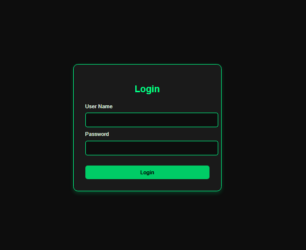
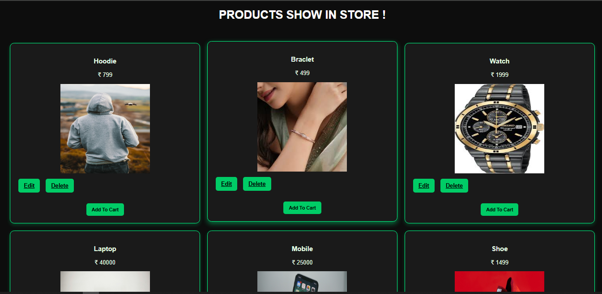

# 🛒 E-Commerce Management System (Spring Boot & MySQL)

A robust Fullstack E-Commerce application built during my professional developer training in Chennai. This project demonstrates **CRUD operations**, **Session Management**, and **Database Integration** using modern Java technologies.

## 🚀 Features
* **Admin Dashboard:** Secure login for administrators to manage inventory.
* **Product Management:** Full CRUD (Create, Read, Update, Delete) functionality for products.
* **Dynamic UI:** Responsive frontend using **Thymeleaf** with a custom Dark/Neon-Green theme.
* **Real-time Interaction:** Integrated JavaScript prompts for ID-based updates and deletions.
* **Database Integration:** Seamless connectivity with MySQL using **Spring Data JPA**.

## 🛠️ Tech Stack
* **Backend:** Java 17, Spring Boot, Spring Data JPA, Hibernate.
* **Frontend:** Thymeleaf, HTML5, CSS3 (Custom Styling), JavaScript.
* **Database:** MySQL.
* **Tools:** Gemini AI, Eclipse, Git & GitHub.

## 📸 Screenshots

### Admin Login Page

### Product Dashboard (Neon Theme)

## 📂 Project Structure
* `src/main/java`: Contains the Controller, Entity, Repository, and Service layers.
* `src/main/resources/static`: Holds CSS, JavaScript, and Product Images.
* `src/main/resources/templates`: Contains Thymeleaf (HTML) pages.

## ⚙️ How to Run
1. Clone the repository: `git clone https://github.com/Badhusha01/E-commerce-SpringBoot-MySql.git`
2. Create a database named `ecommerce` in MySQL.
3. Update `src/main/resources/application.properties` with  MySQL username and password.
4. Run the `EcommerceApplication.java` as a Spring Boot App.
5. Access the application at: `http://localhost:8080/adminlog`
